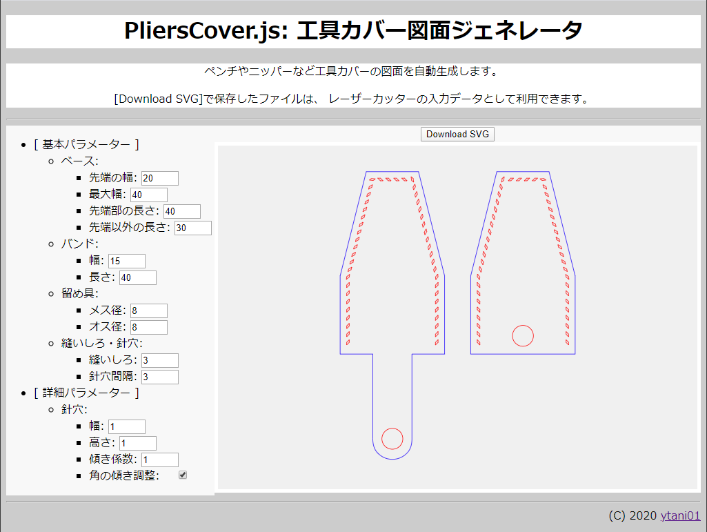
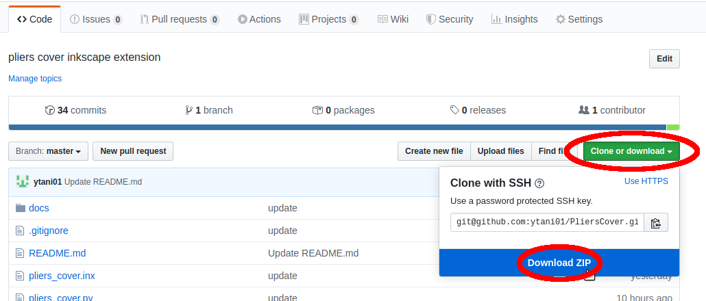

# [PliersCover JavaScript](https://ytani01.github.io/PliersCover.js/)

工具カバーのレザークラフト用図面を自動作成 (JavaScript)

[``【使ってみる！】``](https://ytani01.github.io/PliersCover.js/pliers_cover.html)


## 概要

ラジオペンチやニッパーなどの工具カバーのレザークラフト用図面を
自動作成します。

SVG形式でファイルに保存し、
レーザーカッターなどで利用できます。

(もちろん、紙に印刷して、従来通りの手作業も可能。)

ブラウザの画面上で確認しながらサイズを調整できます。

針穴は菱目で、微調整が可能です。

針穴の位置は、必ず角に来るように自動的に調整されます。

[Inkscape拡張機能版](https://ytani01.github.io/PliersCover/)もあります


## 1. 使い方

[](https://ytani01.github.io/PliersCover.js/pliers_cover.html)<br />

* 入力欄にサイズを入力
* どれかを一つでも変更すると、その場で直ちに反映されます。
* ``[Download SVG]``ボタンで、SVGファイルに保存することができます。


### 1.1 注意・コツなど

* 角に、針穴が来るように自動調節されるので、
辺ごとに針穴の間隔が多少不揃いになることがあります。
縫いしろや針穴のパラメータを微調整調整して、
針穴が均等になるようにしましょう。


## 2. ローカル(オフライン)で使う場合

ダウンロードして、``pliers_cover.html``をブラウザで開いてください。

実行に必要なファイルは、以下の2つだけです。
* pliers_cover.html
* pliers_cover.js


### 2.1 ダウンロード

サイトのURL

[https://github.com/ytani01/PliersCover.js/](https://github.com/ytani01/PliersCover.js/)

ZIP形式のファイルをダウンロードして展開するか、
``git``に慣れている方は、慣れた方法でリポジトリをクローンしてください。


#### 2.1.1 ZIPファイルをダウンロードして展開する方法




#### 2.1.2 Gitリポジトリをクローン(clone)する方法

```bash
$ git clone https://github.com/ytani01/PlierCover.js.git
```


## A. Memo

### A.1 SVGパスのコマンド

```
(大文字: 絶対座標、小文字: 相対座標)

M: moveto (始点座標)
L: lineto
  H: 水平
  V: 垂直
C: curveto: "{C|c} c1x,c1y c2x,c2y x,y"
  (c1x, c1y), (c2x, c2y): 制御点
  x,y: 終点

  * 正円(半円)の場合、制御点までの距離は、直径の約0,75倍(?)
Z: closepath
```

```
ex: d="M 50,60 H 60 l 20,50 Z"
```


## B. 参考

* [Kerf Check Parts Generator](http://doyolab.net/appli/kerf_check/kerf_check.html)
* [PlierCover Inkscape extension](https://github.com/ytani01/PliersCover)
